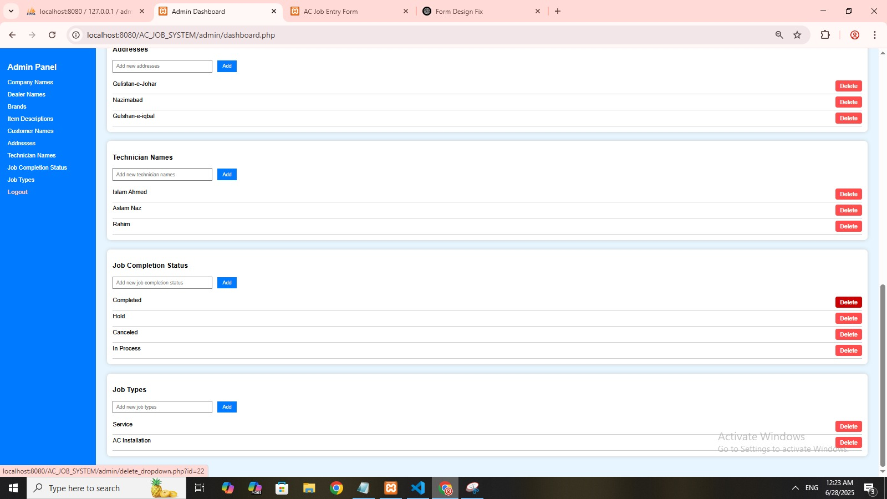
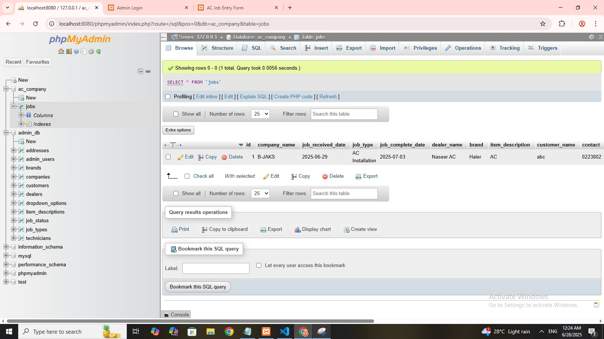

# PHP_PROJECTS
# AC Cool Air Spot – Job Entry Form (PHP Project)

This project is a custom-built job entry form developed for **AC Cool Air Spot Company**, fulfilling real-world client requirements. It enables the company to record job details, technicians, and job completion statuses using a simple web interface.

---

## 📋 Project Description

The form allows the admin to:

- Add **Technician Names**
- Select **Job Completion Status** (In Process, Hold, Canceled, Completed)
- Manage **Job Types** and Company Data
- Store all information in a **MySQL database**

Data validations are handled using PHP, and the layout is styled with Bootstrap.

---

## 💻 Technologies Used

- PHP (Core scripting)
- MySQL (Database)
- HTML, CSS
- Bootstrap 5
- XAMPP (Local development)

---

## 📂 Included Files

- `AC_JOB_SYSTEM.rar` – Contains:
  - All PHP files
  - Database SQL file
  - Bootstrap-based UI
  - Form validation logic

---

## 🖼️ Screenshots

| Admin Panel | Database View |
|-------------|--------------|
|  |  |

---

## 👩‍💻 Developer Info

**Ammara Imran**  
Diploma in Software Engineering – Aptech  
Skilled in dynamic PHP web applications and database-driven systems.

---

## 📬 Contact

📧 **Email:** ammaraimran4444@gmail.com  
🔗 **GitHub:** [github.com/Ammara-Imran](https://github.com/Ammara-Imran)

